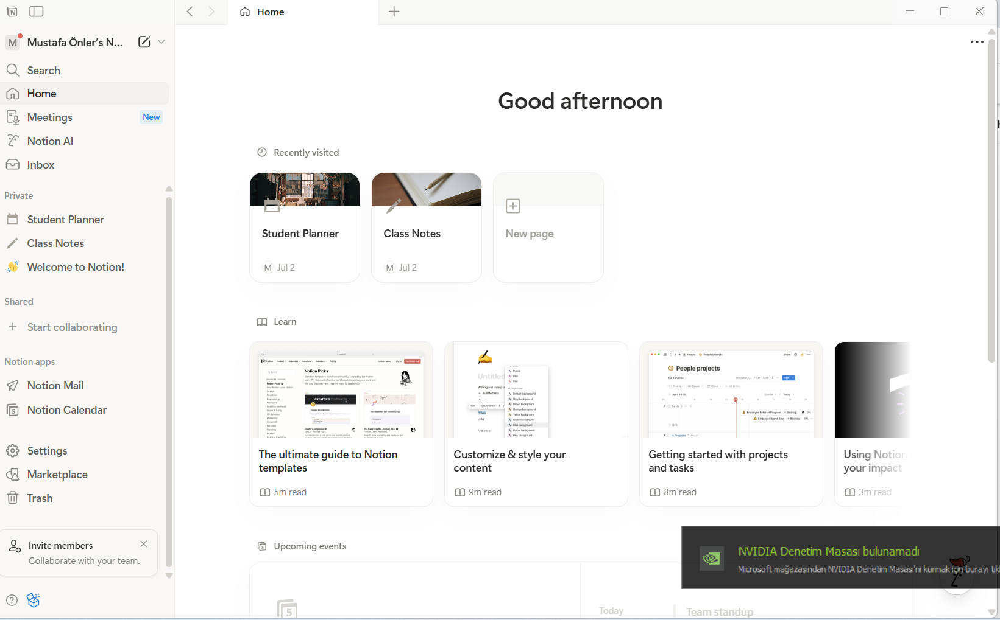

# 🛡️ CyberCheck: Yapay Zeka Destekli Tehdit İstihbarat Platformu

 **CyberCheck**, şüpheli web bağlantılarını (URL), e-postaları ve dosyaları cihazınıza indirmeden bulut ortamında analiz eden, yapay zeka destekli yeni nesil bir siber güvenlik asistanıdır. Fırat Üniversitesi Yazılım Mühendisliği bitirme projem olarak sıfırdan geliştirilmiştir.

---

## 🚀 Proje Özeti & Özellikler

* **🧠 Yapay Zeka Destekli Analiz:** Google Gemini AI entegrasyonu ile tehditler sadece "zararlı" olarak işaretlenmez; oltalama (phishing) taktikleri ve saldırı motivasyonları detaylı bir şekilde raporlanır.
* **🦠 Küresel İstihbarat Ağı:** VirusTotal API entegrasyonu sayesinde hedef dosyalar ve linkler saniyeler içinde 80'den fazla antivirüs motorunda eşzamanlı taranır.
* **📱 Çoklu Platform Desteği:** Hem modern bir Web SOC Dashboard'u (React) hem de taşınabilir bir Mobil Uygulama (Flutter) ile her an yanınızda.
* **📄 Kurumsal Raporlama:** Taramalarınızın sonucunu şık, detaylı ve PDF formatında kurumsal bir siber istihbarat raporu olarak dışa aktarabilirsiniz.
* **🔐 Güvenli Altyapı:** Supabase (PostgreSQL) ile güvenli kimlik doğrulama ve veritabanı yönetimi sağlanır.

---

## 🛠️ Teknolojik Yığın (Tech Stack)

* **Backend:** Node.js, Express.js, Supabase, VirusTotal API, Google Gemini AI API
* **Frontend (Web):** React.js, Tailwind CSS, Vite
* **Frontend (Mobil):** Flutter, GoRouter, fl_chart, printing

---

## ⚙️ Kurulum ve Çalıştırma

Projeyi lokalinizde test etmek için adımları izleyin:

```bash
# 1. Depoyu Klonlayın
git clone [https://github.com/mustafaonler/CyberCheck.git](https://github.com/mustafaonler/CyberCheck.git)
cd CyberCheck

# 2. Backend'i Başlatın
cd backend
npm install
npm start # (Not: .env dosyasındaki API key'leri tanımlanmalıdır)

# 3. Web Arayüzünü Başlatın
cd ../frontend-web
npm install
npm run dev

# 4. Mobil Uygulamayı Başlatın
cd ../mobile-app
flutter pub get
flutter run
